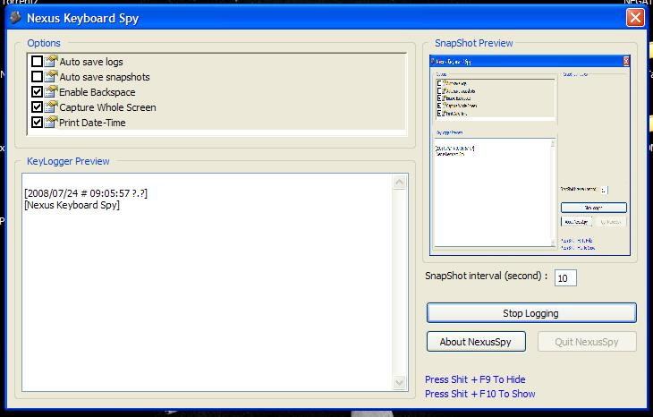



## Nexus Spy \(BETA\)

### Description

This one's just a simple key logger. also you can take snapshots with it. ive seen some codes for taking a snapshot from the screen by using Virtual Key API. and thats kinda not right, 'cause when you're monitoring and logging pressed keys, also those virtual pressed keys will be logged, so ive used another way in this program.

there are some simple options like enabling Backspace key, so backspace characters won't be logged as will behave like its normal way. printing date-time, auto-save logs and snapshots.

this program uses only MS Common Controls 6.0 and Common Dialog Control 6.0. its a beta version so ill upgrade this as well.

enjoy!
 
### More Info
 

             |
---                |---
**Submitted On**   |2008-07-03 21:18:04
**By**             |[INexusCore](https://github.com/Planet-Source-Code/PSCIndex/blob/master/ByAuthor/inexuscore.md)
**Level**          |Advanced
**User Rating**    |4.3 (13 globes from 3 users)
**Compatibility**  |VB 5\.0, VB 6\.0
**Category**       |[Complete Applications](https://github.com/Planet-Source-Code/PSCIndex/blob/master/ByCategory/complete-applications__1-27.md)
**World**          |[Visual Basic](https://github.com/Planet-Source-Code/PSCIndex/blob/master/ByWorld/visual-basic.md)
**Archive File**   |[Nexus\_Spy\_2121697242008\.zip](https://github.com/Planet-Source-Code/inexuscore-nexus-spy-beta__1-70877/archive/master.zip)

### API Declarations

A couple, see the code.

